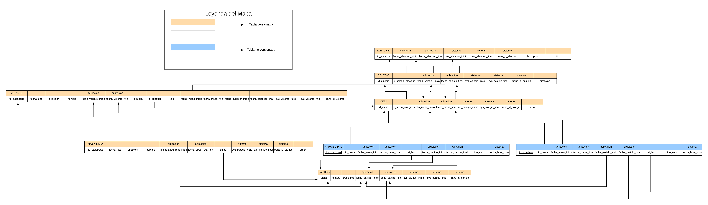
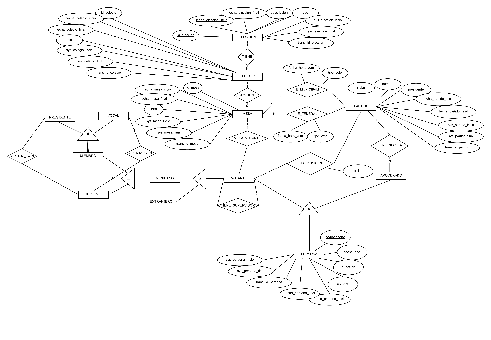

# Tarea 1. SQL Avanzado

---

##### Integrantes:
1. *Alejandra Nissan Leizorek* - *A01024682* - *CSF*
2. *Yann Le Lorier Bárcena* - *A01025977* - *CSF*
3. *Isaac Harari Masri* - *A01024688* - *CSF*
4. *Roberto Gervacio Guendulay* - *A01025780* - *CSF*

---
## 1. Aspectos generales

Las orientaciones de la tarea se encuentran disponibles en la plataforma **Canvas**.

Este documento es una guía sobre qué información debe entregar como parte de la tarea, qué requerimientos técnicos debe cumplir y la estructura que debe seguir para organizar su entrega.


### 1.1 Requerimientos técnicos

A continuación se mencionan los requerimientos técnicos mínimos de la tarea, favor de tenerlos presente para que cumpla con todos.

* El equipo tiene la libertad de elegir las tecnologías de desarrollo a utilizar en la tarea, sin embargo, debe tener presente que la solución final se deberá ejecutar en una plataforma en la nube. Puede ser  [Google Cloud Platform](https://cloud.google.com/?hl=es), [Azure](https://azure.microsoft.com/en-us/), AWS [AWS](https://aws.amazon.com/es/free/) u otra.
* El equipo tiene la libertad de utilizar el DBMS de su preferencia.
* La arquitectura de la solución deberá estar separada claramente por capas (*frontend*, *backend*, datos y almacenamiento).
* Todo el código, *scripts* y la documentación de la tarea debe alojarse en este repositorio de GitHub, siguiendo la estructura que aparece a continuación.

### 1.2 Estructura del repositorio

El proyecto debe seguir la siguiente estructura de carpetas:
```
- / 			        # Raíz de toda la tarea
    - README.md			# Archivo con la información general de la tarea (este archivo)
    - frontend			# Carpeta con la solución del frontend (Web app)
    - backend			# Carpeta con la solución del backend en caso de ser necesario (CMS o API)
    - scripts		        # Carpeta con los scripts necesarios para generar la base de datos, cargar datos y ejecutar las consultas
    - database			# Carpeta con el diagrama Entidad-Relación Extendido y los archivos CSV de datos necesarios para generar la bases de datos

```

### 1.3 Documentación de la tarea

Como parte de la entrega de la tarea, se debe incluir la siguiente información:

* Diagrama del *Modelo Entidad-Relación Extendido*.
* *Scripts* para generar la base de datos, cargar datos y ejecutar consultas.
* Archivos CSV con los datos a cargar en la base de datos.
* Guía de configuración, instalación y despliegue de la aplicación en la plataforma en la nube  seleccionada.
* El código debe estar documentado siguiendo los estándares definidos para el lenguaje de programación seleccionado.

## 2. Solución

A continuación aparecen descritos los diferentes elementos que forman parte de la solución de la tarea.

### 2.1 Modelo de la *base de datos*





### 2.2 Arquitectura de la solución


### 2.3 Frontend
&nbsp;https://jamstack.org/

JamSTACK es una forma de desarrollar aplicaciones que permite mayor flexibilidad al momento de realizar el deploy, en donde no depende la aplicación de cosas como de un sólo servidor, sino que también usa CDN (Channel Deployment Network), y está todo en algún repositorio Git.

Cualquier persona podría hacerle *clone* al proyecto, con instalaciones mínimas para incrementar el número de potenciales colaboradores al proyecto.

#### 2.3.1 Lenguaje de programación
El lenguaje de programación que se utilizó para el frontend es JavaScript, junto con el *runtime environment* de Node.js

#### 2.3.2 Framework

El framework utilizado es React, una librería de JavaScript que permite crear interfaces de usuario de forma fácil, permite el desarrollo de aplicaciones en una sóla página. Está mantenido por Facebook, y es open source.

#### 2.3.3 Librerías de funciones o dependencias

```js
"dependencies": {
		"@stardust-ui/docs-components": "^0.40.0",
		"@stardust-ui/react": "^0.40.4",
		"@testing-library/jest-dom": "^4.2.4",
		"@testing-library/react": "^9.3.2",
		"@testing-library/user-event": "^7.1.2",
		"axios": "^0.19.2",
		"chartist": "^0.11.4",
		"date-fns": "^2.10.0",
		"prop-types": "^15.7.2",
		"react": "^16.12.0",
		"react-chartist": "^0.14.3",
		"react-datepicker": "^2.14.0",
		"react-dom": "^16.12.0",
		"react-hook-form": "^4.10.1",
		"react-nice-dates": "^2.0.0",
		"react-router-dom": "^5.1.2",
		"react-scripts": "3.3.1",
		"semantic-ui-react": "^0.88.2"
	},
```

### 2.4 Backend

El backend utilizado es la combinación del framework de Flask y Python. Dentro de Python, se instalaron dos módulos para la conexión con db2: flask_db2 y ibm_db2.

#### 2.4.1 Lenguaje de programación
El lenguaje de programación utilizado es Python, ya que es un lenguaje que tiene frameworks optimizados para su utilización con bases de datos, y múltiples DBMSs, lo escojimos porque flask es una buena y simple opción para conectar la base de datos.

Entre los DBMSs que manipula, está DB2, el DBMS de nuestra elección.
#### 2.4.2 Framework
El framework utilizado permite el desarrollo de aplicaciones, y de la conexión con alguna base de datos.

En nuestro caso, utilizamos el DBMS de db2, junto con una imagen en Docker.

```py
from flask import Flask, jsonify, redirect
from flask_db2 import DB2

app = Flask(__name__)
#después se procede a configurar la conexión de db2, como el password y la conexión del puerto
```

#### 2.4.3 Librerías de funciones o dependencias

```py
Flask==1.1.1
Flask-Cors==3.0.8
Flask-DB2==0.0.10
gunicorn==20.0.4
httplib2==0.9.2
ibm-db==3.0.1
unidiff==0.5.4
urllib3==1.22
virtualenv==20.0.4
```

## 2.5 Pasos a seguir para utilizar la aplicación

Para correr la aplicación, se debe de tener instalado python3 y npm


### Correr la aplicación de forma local
clonar el repositorio de git usando https:
```sh
git clone https://github.com/tec-csf/tc3041-t1-primavera-2020-equipo7.git
```

En el repositorio encontrará carpetas llamadas backend y frontend.

#### Lanzando una imagen de docker localmente

```sh
#Creacion del contenedor con la base de datos

sudo docker run -itd --name mydb2 --privileged=true -p 50000:50000 -e LICENSE=accept -e DB2INST1_PASSWORD=password -e DBNAME=testdb ibmcom/db2 bash -v <path>:/database ibmcom/db2

#si ya estaba creado
sudo docker start mydb2

#ver cuando termine de crearse
sudo docker logs -f mydb2

#Conectandose a la base de datos
sudo docker exec -ti mydb2 bash

su - db2inst1

#ya en el bash de la imagen:
db2
```

#### Carpeta backend
Es posible correr el programa con o sin un ambiente virtual (este paso asume que ya se creó la instancia de docker).

Primero necesitará instalar las dependencias:
```sh
pip3 install Flask
pip3 install ibm_db
pip3 install Flask-db2
```
En la carpeta, con el ambiente virtual activado (o no), correr:

```sh
python3 api_ien.py
```

Esto abrirá el puerto de su computadora de su elección (si no cambió nada se abrirá el puerto 5001)

#### Carpeta frontend

Dentro de la carpeta de frontend:

Instalemos las dependencias (debian-ubuntu):
```sh
sudo apt-get update
sudo apt-get install npm
```

Para correrlo:
```sh
npm install
npm start
```
Esto abrirá un puerto en su computadora (3000)

Aquí el API se encarga de cargar la base de datos al frontend, y ya puede correr las operaciones CRUD en el frontend

### Lanzar la aplicación a la nube


## 3. Referencias

* &nbsp;&nbsp;Matchett, R. (2012, April 30). Temporal Tables in DB2. Retrieved March 3, 2020, from https://www.ibmbigdatahub.com/blog/temporal-tables-db2 
* &nbsp;&nbsp;IBM Mainframe. (2010, March 9). Self Referencing Constraints? Retrieved March 3, 2020, from https://ibmmainframes.com/about47273.html 


